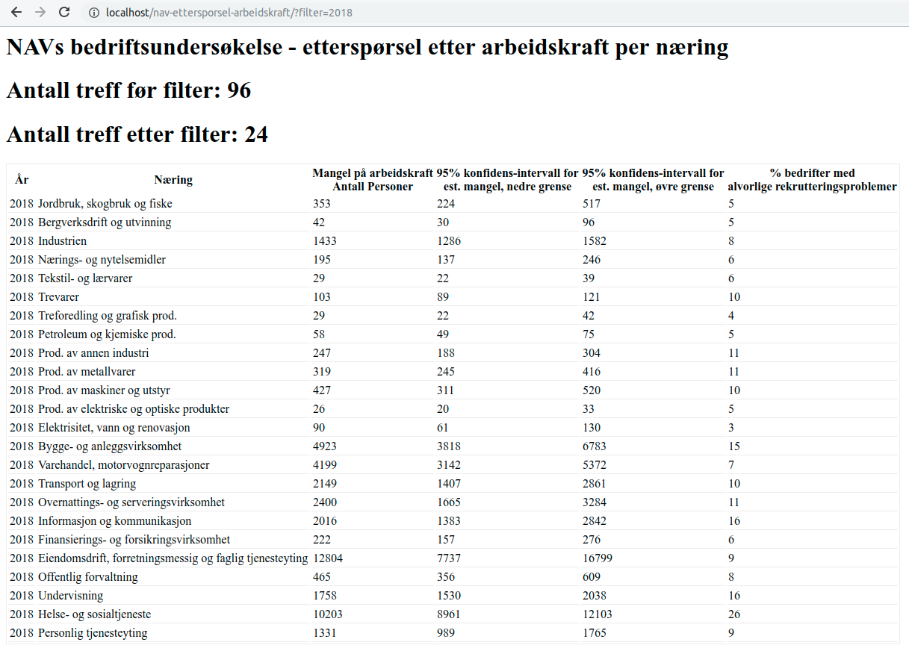

NAV etterspørsel arbeidskraft
======

Dette er en PHP klasse som kan brukes for å lese av den siste bedriftsundersøkelsen publisert av NAV (etterspørsel etter arbeidskraft pr næring).

Klassen benytter eget namespace for å unngå konflikt med eksisterende rammeverk/bibliotek. 

`index.php` filen viser et eksempel på hvordan man leser det ut fra klassen. 

Data leses av en csv fil som hentes fra data.nav.no, men blir cachet til en lokal `cache.csv` fil.

https://data.nav.no/dataset/92173c56-2262-47b2-9662-d0ceacf406d1/resource/a696d765-1ccb-46ca-a43e-7ec69af156ff/download/navs-bedriftsundersokelse---ettersporsel-etter-arbeidskraft-per-naering.csv

Gjerne send inn issues/pull requests ved eventuelle spørsmål eller forbedringer.

